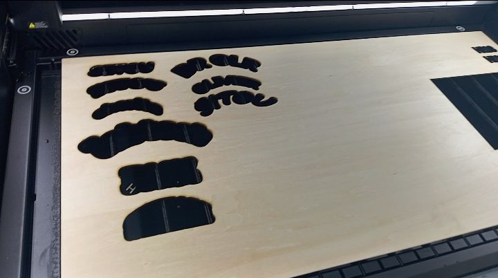

# Journal du mercredi 26 août 2026 (rédigé par : Komnakan YOMBOU)

## Fait aujourd'hui

- Constitution des groupes de travail ; affectation au groupe 04
- Atelier « Formation technique — Fabrication numérique / Fabrication additive » : introduction à la fabrication additive, historique de l'impression 3D, grandes familles de technologies, tableau comparatif des technologies
- Atelier « Gestion de projet » : présentation du projet de fin de formation et des critères de choix (priorité à un projet à but éducatif, répondant à un problème majeur de l'éducation)
- Atelier « Technologie découpe laser » : anatomie d'une découpeuse laser, grandes familles de lasers industriels ; installation du logiciel XTools ; envoi d'un texte à la machine et découpe réussie sur une planche
  
- Atelier « Bases de l'électronique dans les FabLabs » : grandeurs électriques de base, symboles physiques ; mesure de la tension de 2 piles ; mesure de la résistance de 3 résistances ; code couleur des résistances

## Appris

- Les grandes familles de technologies de fabrication additive et leurs différences, via le tableau comparatif
- Le fonctionnement général d'une découpeuse laser et l'usage du logiciel XTools pour envoyer un fichier à la machine
- Comment lire un code couleur de résistance pour en déduire la valeur, et comment cette valeur théorique se compare à une mesure au multimètre

## Raté, puis corrigé

## Décidé

- Pour la mesure de tension, nous avons fait la mesure sur deux piles : une pile noire et une pile verte. Pour le noir, nous avons trouvé une tension de 0,809 V et 1,544 V pour la verte. Nous avons conclu que la noire est déchargée et aussi qu'il existe les incertitudes lors des mesures puisque pour une même pile, nous avons plusieurs valeurs mais qui sont proches.

## À faire demain

