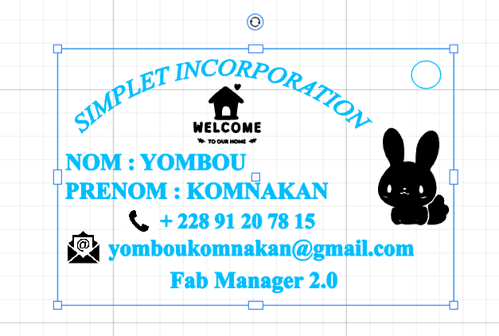
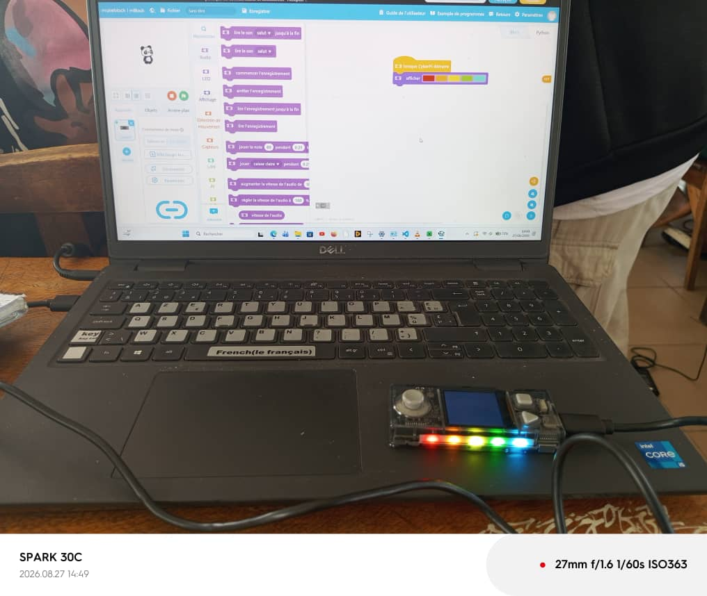
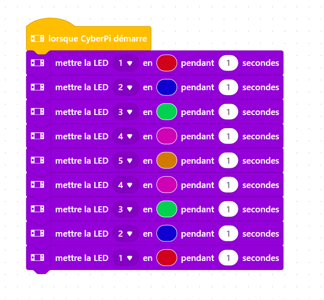
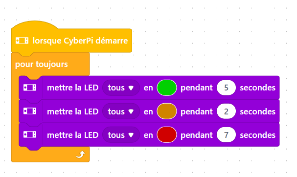
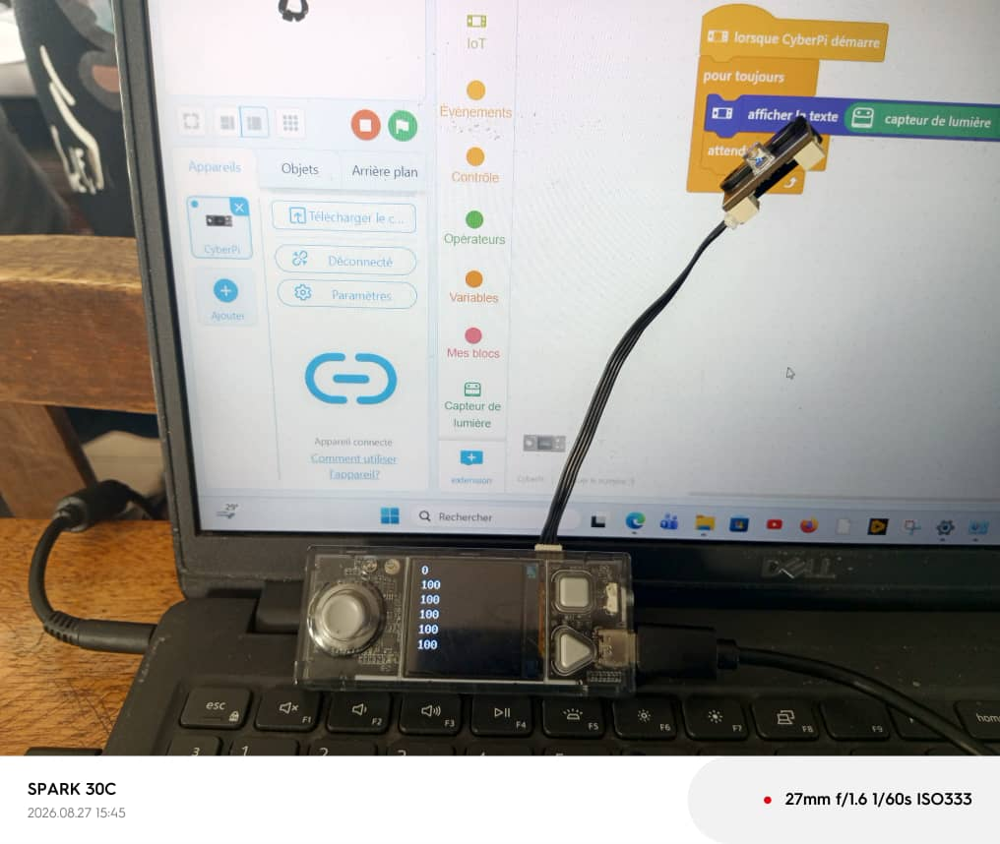
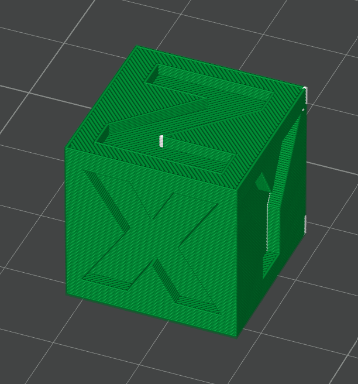
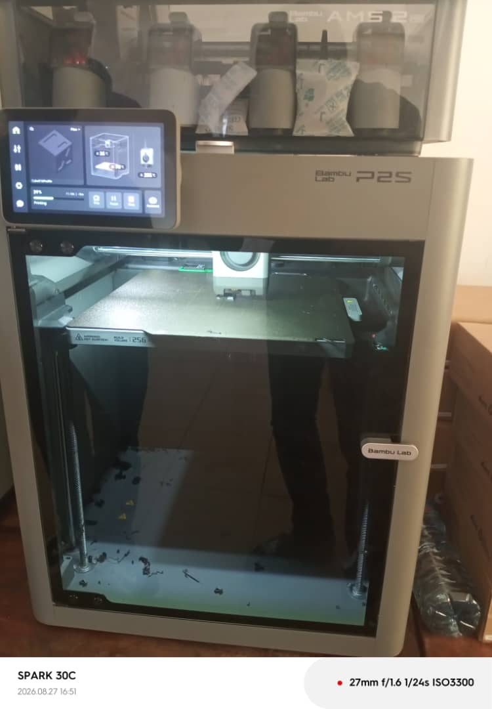
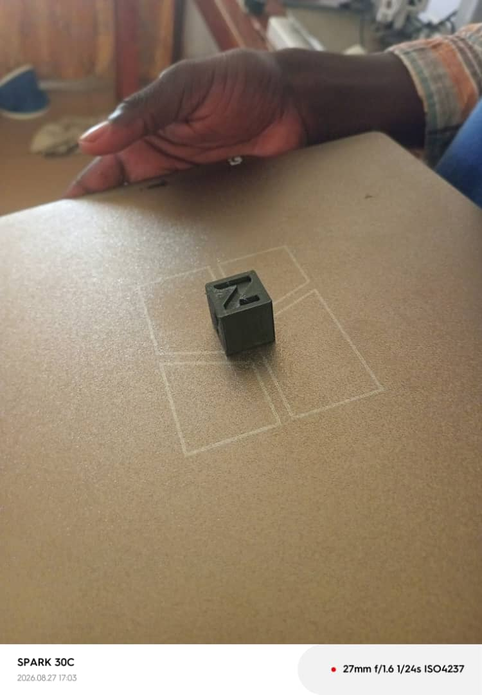

# Journal du jeudi 27 août 2026 (rédigé par : Komnakan YOMBOU)

## Fait aujourd'hui

- Atelier « Découpe laser » : modélisation d'une carte de visite dans XTools, dimensions 85 mm (longueur) × 55 mm (largeur)
- Paramétrage de la découpeuse laser P3 : texte → puissance 20, vitesse 600 mm/s ; contours → puissance 90, vitesse 50 mm/s
  
  
- Atelier « Électronique » : présentation du CyberPi et de l'écosystème mBuild, généralités et capteurs
- Installation du logiciel mBlock ; programmation de l'allumage des LED du CyberPi au démarrage
- Programmation de l'allumage de toutes les LED du CyberPi
  
- Programmation d'un jeu de lumière avec allumage séquentiel par ordre régulier
  
- Programmation d'un feu tricolore : vert 5 s, orange 2 s, rouge 7 s
  
- Programmation de la détection de luminosité environnante via le capteur de lumière : 0 = absence totale de luminosité, 100 = forte luminosité (testé en journée)
  
- Atelier « Impression 3D » : paramètres clés d'une bonne impression (remplissage/infill, parois, couches supérieures et inférieures)
- Installation et prise en main de Bambu Studio ; import d'un fichier cube, simulation puis impression
  
  
  

## Appris

- L'influence de la puissance et de la vitesse laser selon qu'on découpe (contours) ou qu'on grave/marque (texte) : puissance haute + vitesse basse pour couper franchement, puissance basse + vitesse haute pour un rendu plus fin
- La logique de programmation par blocs sous mBlock pour piloter les LED et capteurs du CyberPi
- Les paramètres de tranchage qui conditionnent la qualité d'une impression 3D : infill, parois, couches supérieures/inférieures

## Raté, puis corrigé
- Lors de la pemière programmation du feu tricolore, noous n'avons pas obtenu un cycle continu. Dès que le dispositif fini d'allumer les 3 feux, elle s'éteint. Dans contrôle, nous avons ajouté le pour toujours et ainsi nous avons obtenu un cycle à repétition infinie.

## Décidé
Pour configurer une découpe laser :
- Gravure : Puissance 20 et vitesse 600 mm/s
- Découpage : Puissance 90 et vitesse 50 mm/s

## À faire demain

