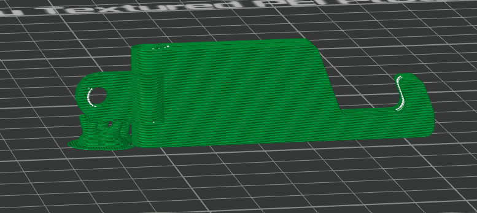
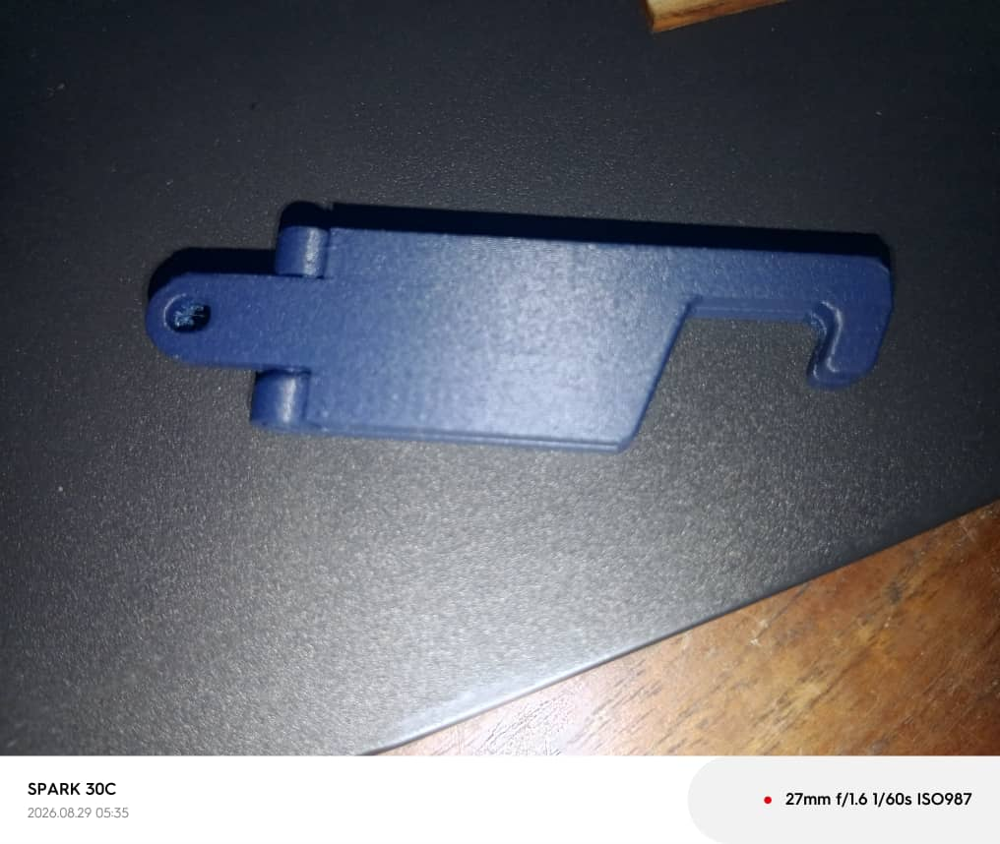
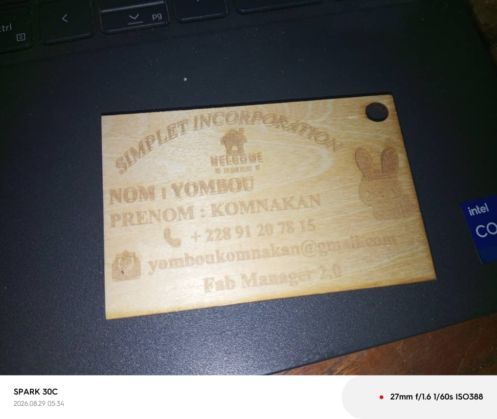
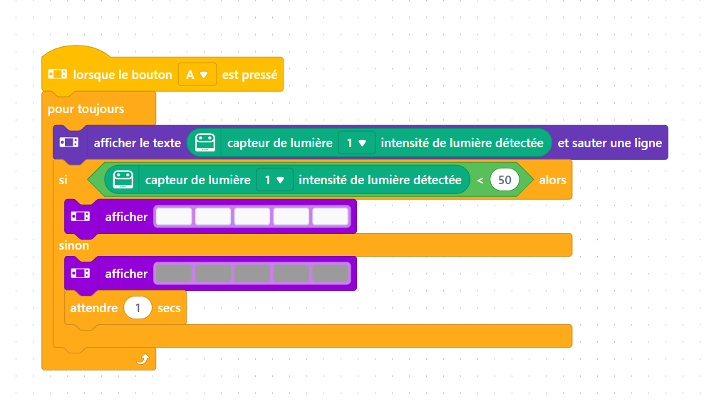
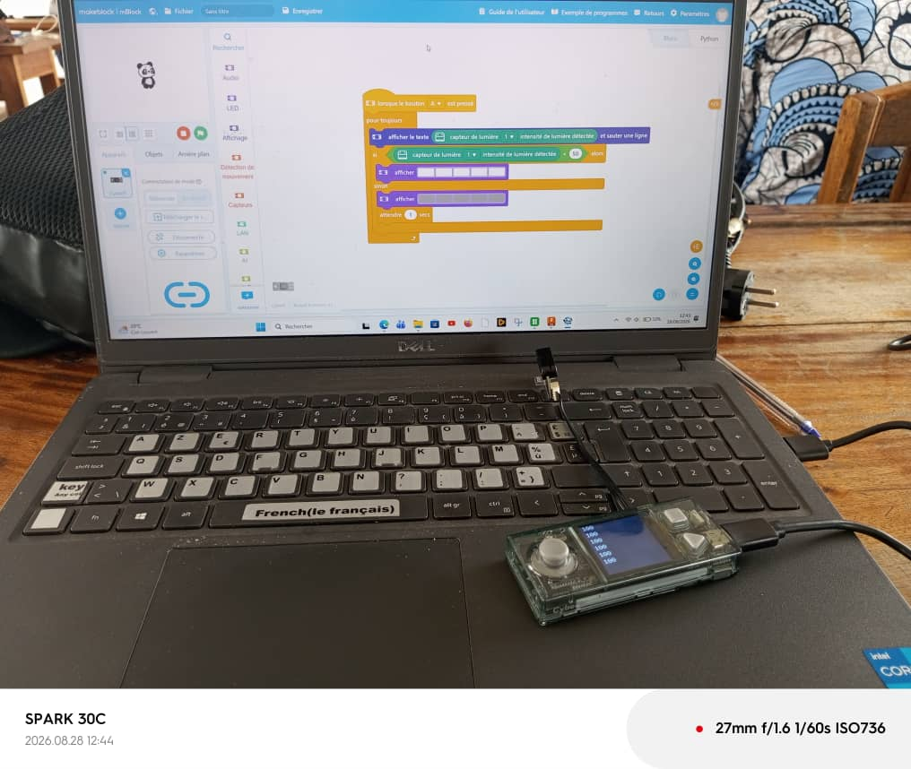
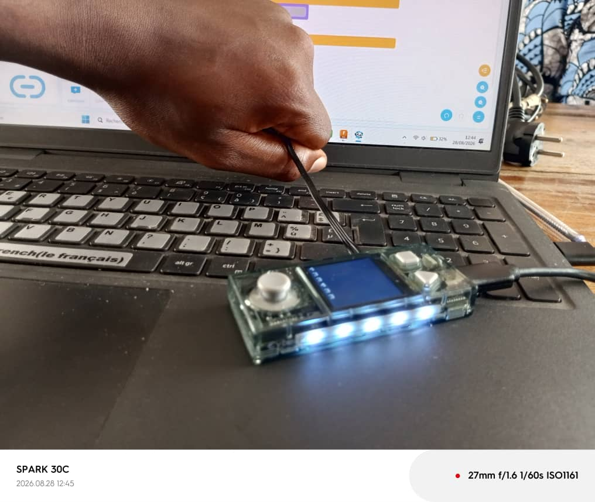

# Journal du vendredi 28 août 2026 (rédigé par : Komnakan YOMBOU)

## Fait aujourd'hui

- Atelier « Impression 3D » : édition d'un support de téléphone dans Bambu Studio, puis impression
  
  
- Atelier « Découpe laser » : gravure puis découpe de la carte de visite conçue le 27 août
  
- Atelier « Électronique » : programmation du CyberPi avec le capteur de lumière pour allumer les LED uniquement la nuit (seuil : luminosité < 50)
  
  
  
- Atelier « Gestion de projet » : présentation du design thinking et de la méthode en spirale, étapes de chacune des deux méthodes

## Appris

- Le design thinking est une démarche centrée sur l'utilisateur, généralement organisée en cinq étapes (empathie, définition du problème, idéation, prototypage, test), répétées de façon itérative jusqu'à ce que la solution réponde vraiment au besoin.
- La méthode en spirale, structure un projet en boucles successives comportant chacune quatre temps : fixer les objectifs et contraintes, analyser les risques, développer et vérifier la solution retenue, puis revoir les résultats avant de relancer un nouveau tour. Contrairement à un déroulé linéaire, l'accent est mis sur la gestion du risque à chaque tour.
- Pour notre projet de fin de formation à but éducatif, ces deux méthodes se complètent : le design thinking pour bien cerner le problème éducatif à résoudre et imaginer des pistes centrées sur l'utilisateur (élève, enseignant), la spirale pour cadrer les itérations de fabrication en tenant compte des risques (délais, matériel, faisabilité technique) jusqu'au jalon final.

## Raté, puis corrigé

## Décidé

## À faire demain

- Chaque groupe va choisir son projet.
