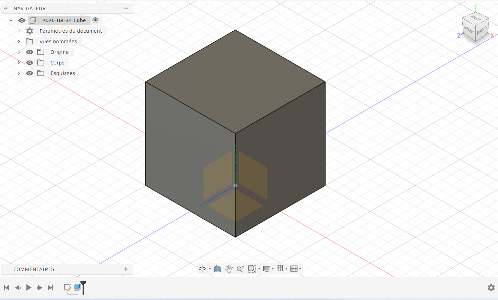

# Journal du lundi 31 août 2026 (rédigé par : Komnakan YOMBOU)

## Fait aujourd'hui

- Réorientation du projet de fin de formation : abandon de l'indicateur sonore au profit d'un **Robot éducatif** intelligent et modulaire.
- Établissement de la nomenclature complète et sécurisée des composants du robot (incluant ESP32-S3, châssis 2 roues, driver moteur, capteurs IR, capteur ultrason HC-SR04, microphone numérique, écran OLED, capteur de lumière, buzzer et éléments de câblage avec marges de rechange).
- Atelier de conception 3D : modélisation d'un cube de référence dans Fusion 360 en vue des futures impressions de pièces pour le châssis et les supports de capteurs.
  

## Appris

- L'importance de redéfinir un cahier des charges clair et validé lors d'un changement de sujet en cours de formation, en veillant à conserver la complexité technique requise (multiples capteurs, actionneurs et procédés de fabrication).
- La prise en main de l'environnement de modélisation 3D de Fusion 360 pour concevoir des géométries paramétriques.

## Raté, puis corrigé

- Aucun incident technique majeur aujourd'hui, transition du projet validée collectivement.

## Décidé

- Le projet officiel de l'équipe 20 est désormais le Robot éducatif multipaysage.
- Utilisation de Fusion 360 pour l'ensemble de la conception mécanique des pièces personnalisées du robot.

## À faire demain

- Continuer la prise en main du logiciel fusion 360.
- Démarrer la modélisation des supports de capteurs (ultrason et infrarouges) et rédiger la première ébauche de la fiche projet et du plan en spirale (V0) pour le jalon.