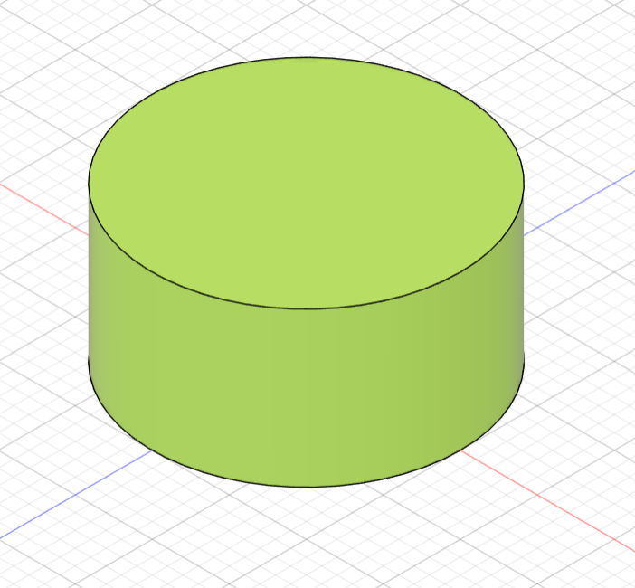
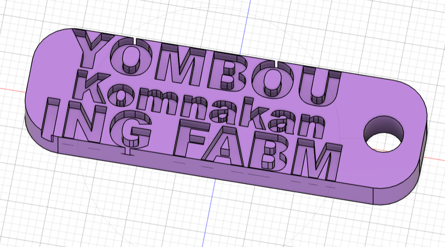
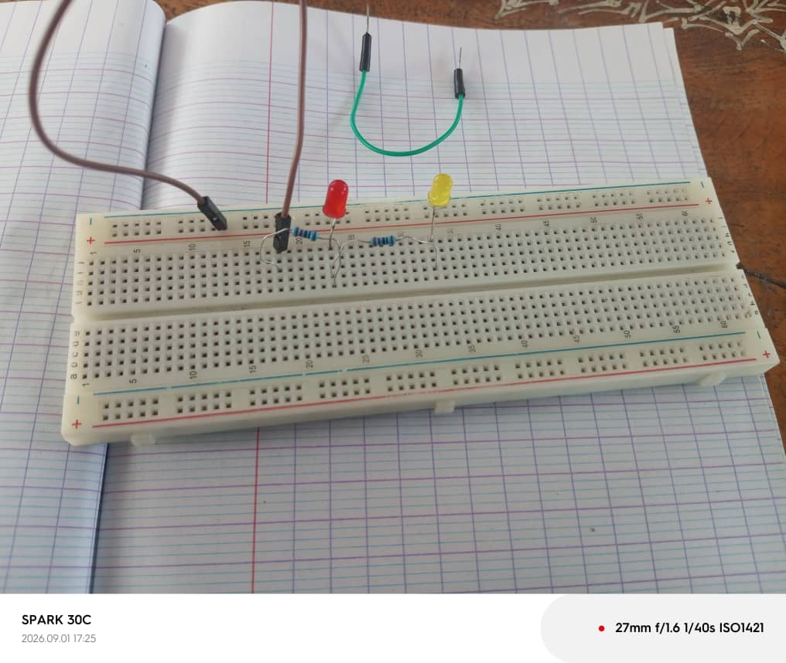

# Journal du mardi 1er septembre 2026 (rédigé par : Komnakan YOMBOU)

## Fait aujourd'hui

- Modélisation dans Fusion 360 : réalisation d'un cylindre par trois méthodes différentes (révolution d'un profil, extrusion d'un cercle, et forme primitive cylindre directement disponible dans la bibliothèque de formes)

  
  
  
- Impression DTF avec XTools, via l'appareil « Printer »
  
  
  
- Montage de circuits électroniques simples sur breadboard SK01, dans le but de se familiariser avec la plaque d'essai
  

## Appris

- Une même forme (le cylindre) peut être obtenue par plusieurs méthodes de modélisation dans Fusion 360 : révolution d'un profil 2D, extrusion d'une esquisse, ou forme primitive préconstruite — chaque méthode a ses cas d'usage selon la complexité de la pièce visée
- Le fonctionnement de l'impression DTF sous XTools via l'appareil Printer
- La prise en main du breadboard SK01 pour monter rapidement un circuit sans soudure

## Raté, puis corrigé

## Décidé

- Pour l'impression DTF, nous avons décidé de prendre une image avec les dimensions <= 100 pour une impression plus rapide et plus fluide.

## À faire demain

