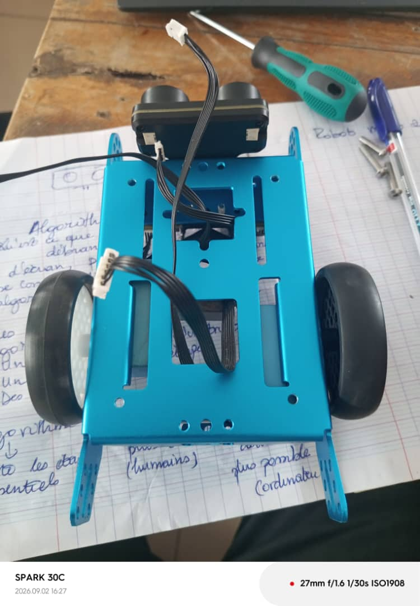
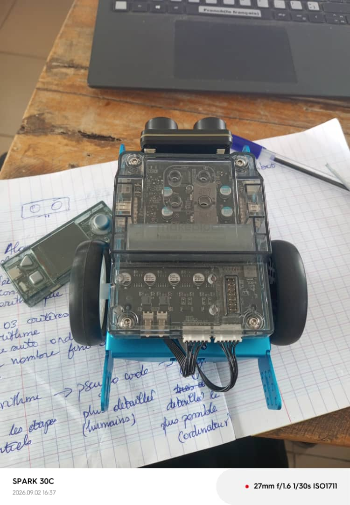
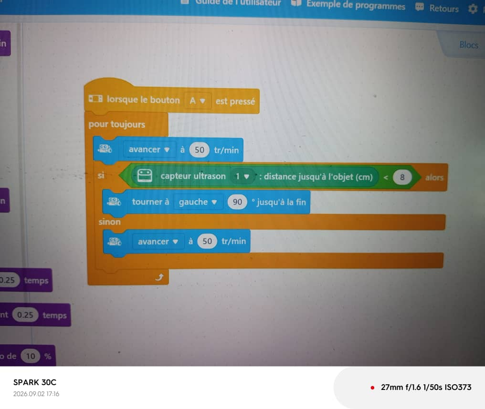

# Journal du mercredi 2 septembre 2026 (rédigé par : [Prénom NOM])

## Fait aujourd'hui

- Atelier « Gestion de projet » : revue du modèle V0 du robot, avec révision des composants retenus et des fonctionnalités prévues
- Atelier « Algorithmique » : présentation et discussion des notions d'algorithmique
- Montage et programmation d'un robot mBot, avec contournement d'obstacles grâce au capteur à ultrasons
  
  
  

## Appris

- La démarche de revue de projet : confronter le modèle V0 prévu aux composants et fonctionnalités réellement disponibles, et ajuster si besoin avant de poursuivre
- Des notions d'algorithmique appliquées à la prise de décision d'un robot (condition, boucle de contrôle)
- La prise en main du robot mBot et de la logique de contournement d'obstacle à partir d'un capteur à ultrasons — directement transposable au capteur HC-SR04 prévu pour le robot de l'équipe

## Raté, puis corrigé

## Décidé

- Pour l'avancée du robot, nous avons programmé le motor du robot sur 50 trs/min.

## À faire demain

