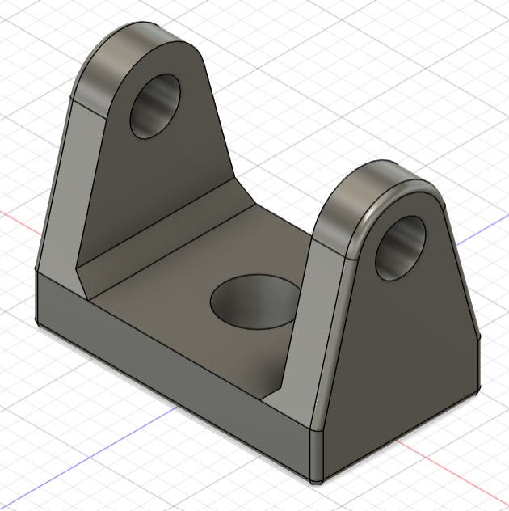
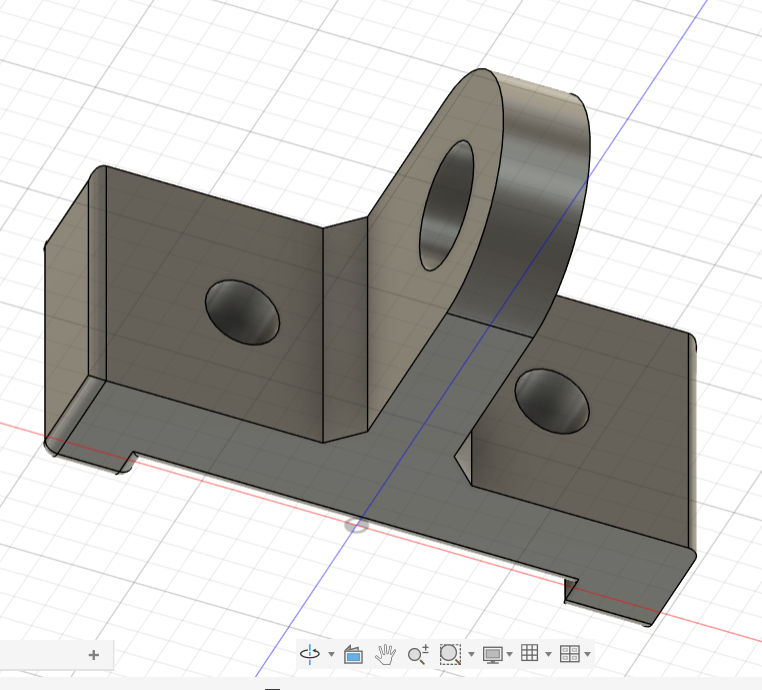
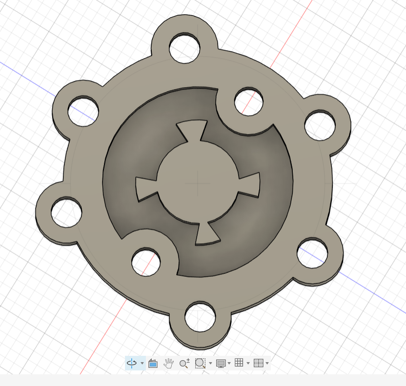
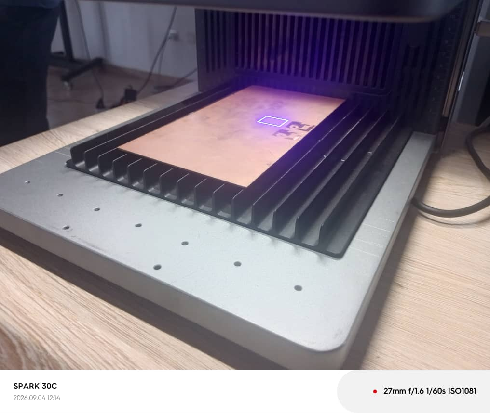

# Journal du vendredi 4 septembre 2026 (rédigé par : Komnakan YOMBOU)

## Fait aujourd'hui

- **Modélisation 3D (Fusion 360)** : 
  - Modélisation de deux corps distincts en utilisant des fonctionnalités avancées telles que la projection d'esquisse, l'extrusion et l'utilisation de plans de construction (plan milieu).
  - Intégration de deux visuels de la modélisation à deux corps :
    
    
  - Récupération de l'exercice pratique assigné à faire à la maison :
    

- **Fabrication de PCB (Électronique)** :
  - Étude théorique des différentes techniques de fabrication de circuits imprimés (PCB).
  - Réalisation pratique de l'impression d'un PCB en utilisant la machine **F2 Ultra**.
  - Intégration de la photo du PCB réalisé :
    

- **Programmation Python (Thonny)** :
  - Poursuite de l'apprentissage de la programmation en Python avec l'étude des structures conditionnelles (`if`, `elif`, `else`) et des boucles (`for`, `while`), indispensables pour la future logique de contrôle du robot éducatif.

## Appris

- La maîtrise des outils de construction géométrique (plan milieu, projection) sous Fusion 360 pour concevoir des assemblages et des pièces complexes à plusieurs corps.
- Les procédés industriels et de prototypage rapide pour la fabrication de circuits imprimés (PCB) à l'aide de la F2 Ultra.
- L'implémentation de la logique algorithmique (conditions et boucles) en Python pour préparer l'automatisation des comportements du robot.

## Raté, puis corrigé

- Ajustement des paramètres de projection et de positionnement des plans de construction sur Fusion 360 pour éviter les erreurs de référence géométrique entre les deux corps.

## Décidé

- Appliquer les techniques de modélisation multi-corps pour la conception personnalisée du châssis et des supports de capteurs de notre robot éducatif.
- Programmer notre Robot en Python.
## À faire demain

- Correction de l'exercice à domicile sur Fusion 360 et préparer la mise en pratique du code Python pour les interactions matérielles.