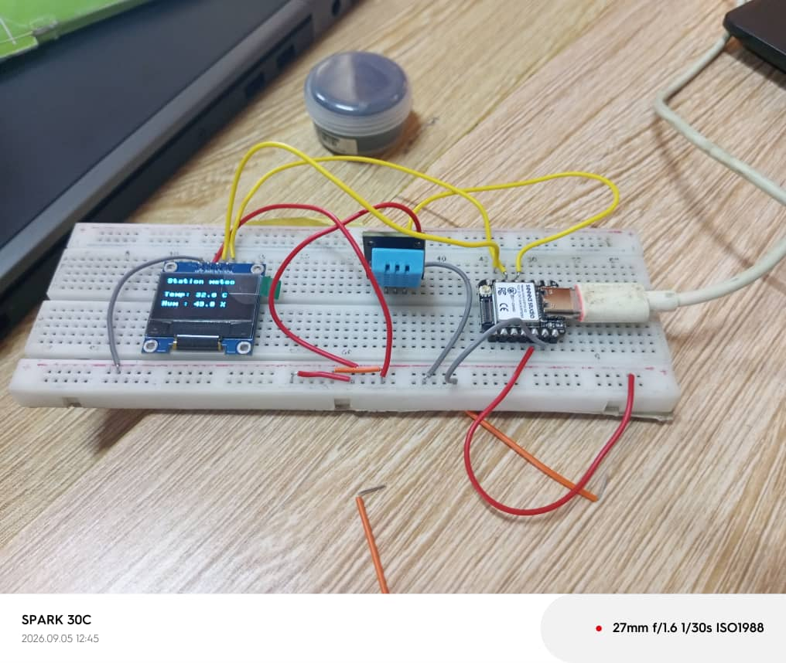
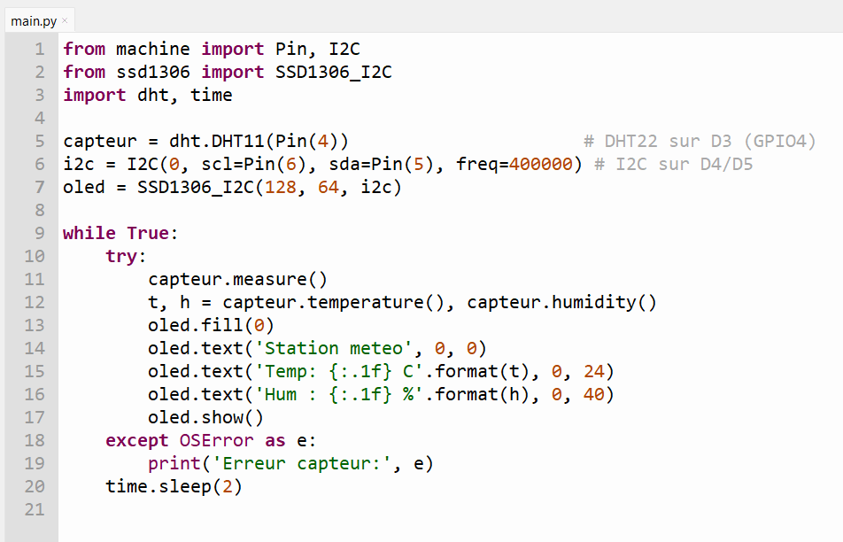

# Journal du samedi 5 septembre 2026 (rédigé par : Komnakan YOMBOU)

## Fait aujourd'hui

- **Projet Station Météorologique** : 
  - Réalisation du montage électronique sur la plaque d'essai (breadboard SK10).
  - Intégration et câblage des composants suivants : la carte **ESP32-S3**, le capteur de température et d'humidité **DHT11**, et un écran **OLED**.
  - Intégration de deux photos illustrant le montage et le système en fonctionnement :
    

- **Programmation (MicroPython / Thonny)** :
  - Écriture et téléversement du code en **MicroPython** à l'aide de l'IDE **Thonny** pour initialiser l'ESP32-S3, lire les valeurs du capteur DHT11 et les afficher en temps réel sur l'écran OLED :
    

## Appris

- La mise en œuvre de scripts en MicroPython pour communiquer avec des capteurs numériques (DHT11) et un écran I2C (OLED) depuis une carte ESP32-S3.
- L'utilisation rigoureuse de la breadboard SK10 pour organiser le câblage d'un système embarqué multi-composants.

## Raté, puis corrigé

- Suite à une première absence d'affichage, nous avons relier les blocs d'alimentation par un pont.

## Décidé

- Valider ce montage comme base fonctionnelle pour l'acquisition et l'affichage de données environnementales.

## À faire

- Poursuivre l'intégration des fonctionnalités et préparer les prochaines étapes du projet.