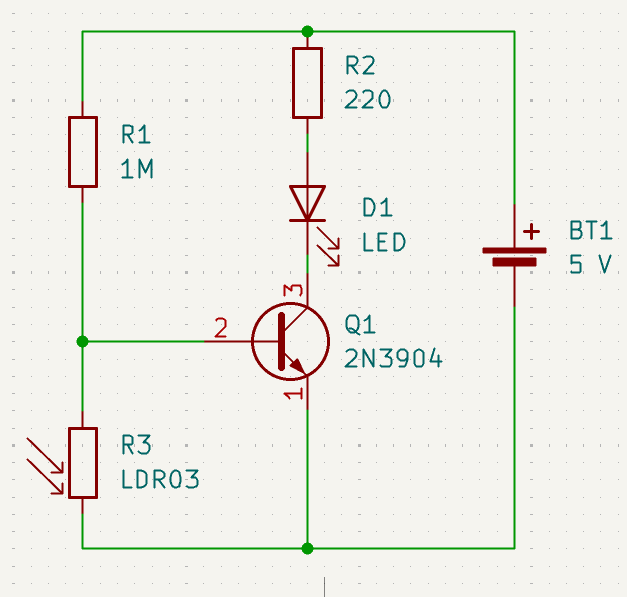
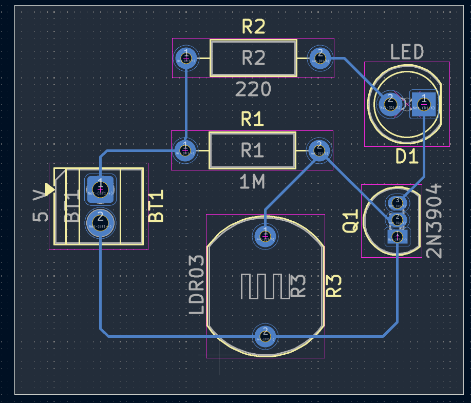
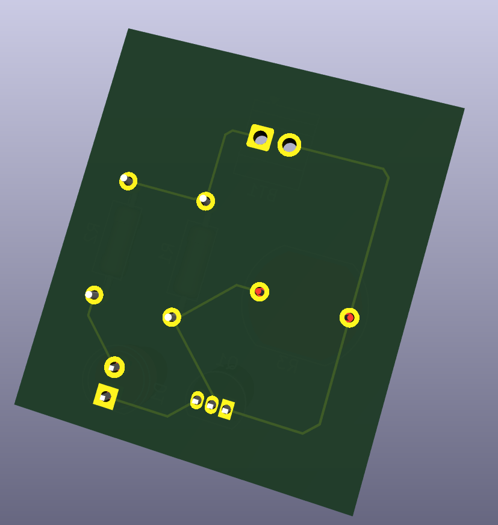
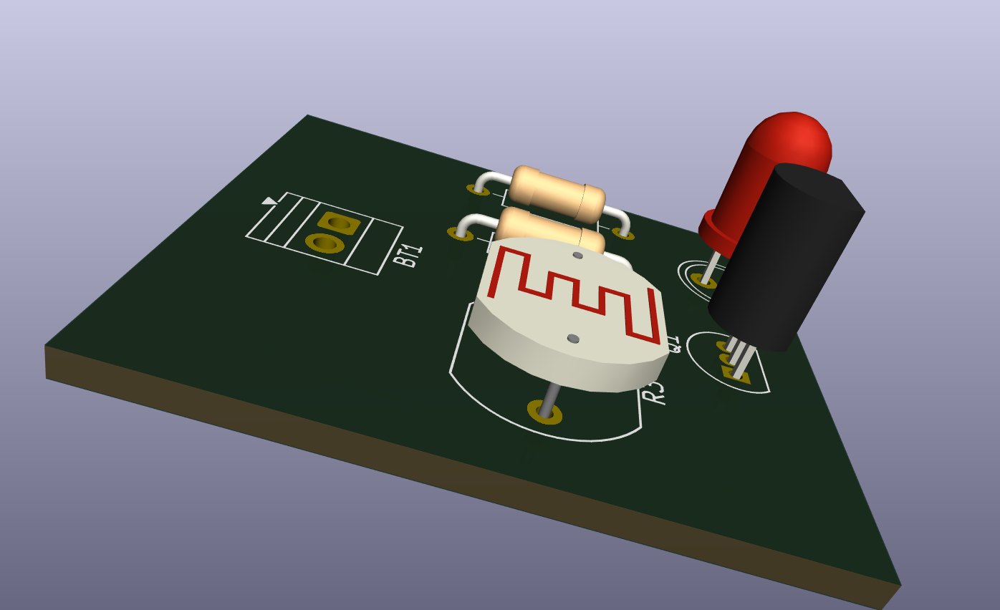

# Journal du lundi 7 septembre 2026 (rédigé par : Komnakan YOMBOU)

## Fait aujourd'hui

- **Cours d'initiation au PCB** : 
  - Session théorique sur les principes de conception des circuits imprimés, les règles de routage et l'importance des empreintes.
- **Réalisation d'un interrupteur crépusculaire sous KiCad** :
  - Conception et dessin du schéma synoptique / schématique du circuit de l'interrupteur crépusculaire :
    
  - Passage à l'éditeur PCB et placement des composants :
    
  - Routage et connexion des pistes électriques :
    
  - Génération et vérification de la visualisation en 3D de la carte finie :
    

## Appris

- La méthodologie complète de conception de circuits imprimés sous **KiCad**, depuis la saisie schématique jusqu'au routage des pistes.
- L'association indispensable entre les symboles schématiques et leurs empreintes physiques (footprints) pour éviter les erreurs de fabrication.
- L'utilisation du rendu 3D pour valider l'encombrement et l'aspect visuel de la carte avant sa production.

## Raté, puis corrigé

- Ajustement de certaines largeurs de pistes et de l'espacement (dégagement) lors du routage pour respecter les règles de l'art de la fabrication de PCB.

## Décidé

- Utiliser KiCad pour la conception de notre future carte d'interface dédiée à notre projet de robot éducatif.

## À faire demain

- Poursuivre l'exploration des outils de CAO électronique et préparer l'intégration des schémas pour le robot.