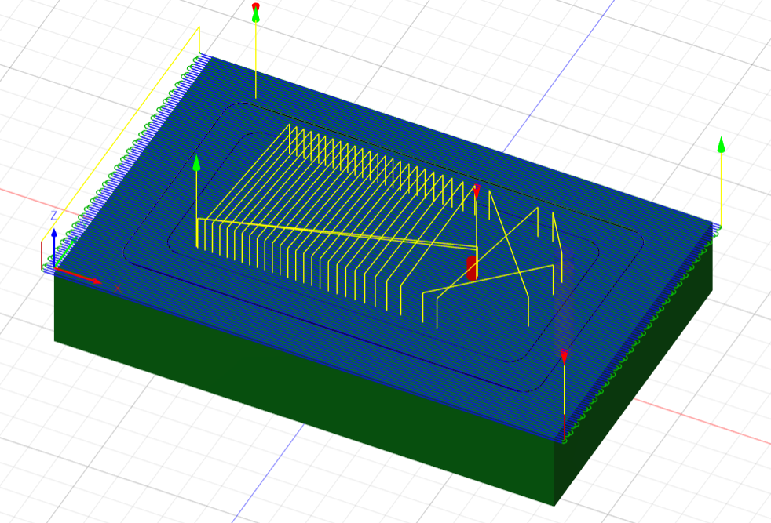
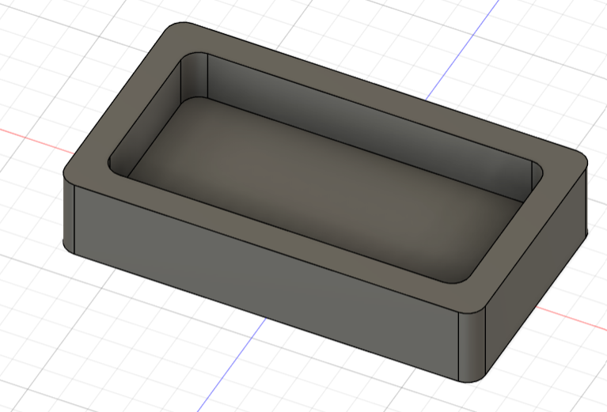

# Journal du mardi 8 septembre 2026 (rédigé par : Komnakan YOMBOU)

## Fait aujourd'hui

- **Travaux sur le projet (Robot éducatif)** : 
  - Tentative de simulation du circuit électronique sous **Wokwi**. Face aux limitations rencontrées sur cette plateforme, bascule et poursuite de la simulation sous **Fritzing** pour affiner le câblage.
- **Cours CAO et FAO** : 
  - Suivi du module sur la Conception Assistée par Ordinateur (CAO) et la Fabrication Assistée par Ordinateur (FAO) : de la conception numérique à la pièce usinée en passant par les parcours d'outils sous **Fusion 360**.
  - Intégration des deux photos illustrant la pièce simulée et la pièce usinée (fraisée) sous Fusion 360 :
    
    

## Appris

- L'adaptation des outils de simulation selon leur complexité et leurs limites (utilisation de Fritzing comme alternative pour la représentation et le câblage des composants).
- Le processus complet de FAO sous Fusion 360, permettant de générer les trajectoires d'usinage (fraisage) à partir d'un modèle 3D tout en respectant les contraintes de fabrication.

## Raté, puis corrigé

- Limitations techniques de Wokwi pour la prise en charge de certains modules spécifiques du robot -> contourné par l'utilisation de Fritzing pour valider le schéma de câblage.

## Décidé

- Structurer les schémas de câblage définitifs sous Fritzing et exploiter Fusion 360 pour la FAO des pièces mécaniques du robot.

## À faire demain

- Poursuivre la mise en œuvre des étapes du projet et la préparation de la documentation technique.