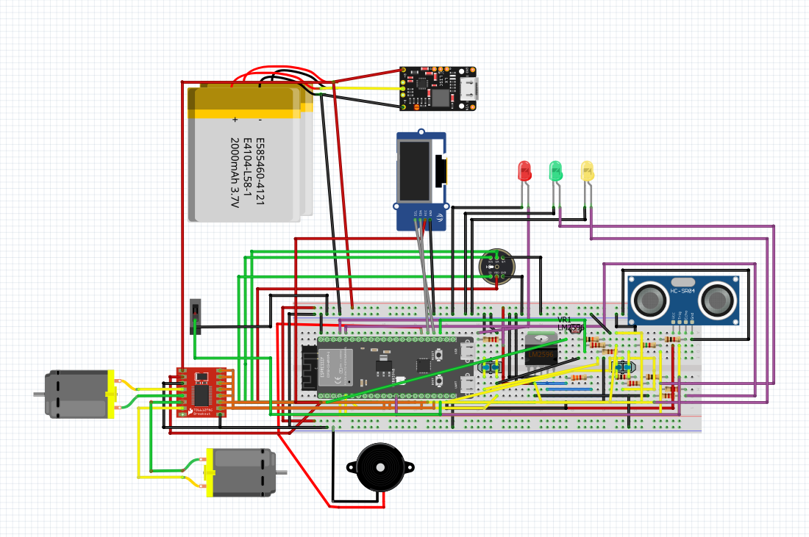

# Journal du jeudi 10 septembre 2026 (rédigé par : Komnakan YOMBOU)

## Fait aujourd'hui

- **Travaux sur le projet (Robot éducatif)** : 
  - Finalisation complète du câblage de notre circuit sur **Fritzing** :
    
  - Constat des limites de Fritzing (absence de module de simulation dynamique pour notre montage), entraînant la décision de reprendre rapidement le circuit sous **Proteus** pour effectuer la simulation.
- **Tests matériels** :
  - Réception d'une partie des composants de notre nomenclature.
  - Réalisation de tests de bon fonctionnement et de vérification de l'état des éléments reçus (écran LCD, LEDs, carte XIAO ESP32-S3, etc.) : 
     

## Appris

- L'importance de choisir le bon outil de simulation selon les besoins fonctionnels (Fritzing pour la schématisation et le câblage visuel, Proteus pour la simulation logique et comportementale).
- La nécessité de tester systématiquement les composants reçus avant l'assemblage final pour anticiper toute défaillance matérielle.

## Raté, puis corrigé

- Impossibilité de simuler le comportement du circuit sous Fritzing -> correction : planification d'une reprise du schéma sous Proteus.

## Décidé

- Migrer la simulation sous Proteus pour valider le comportement logique de notre montage électronique.

## À faire demain

- Poursuivre la simulation sous Proteus et entamer l'assemblage physique des premiers modules testés.