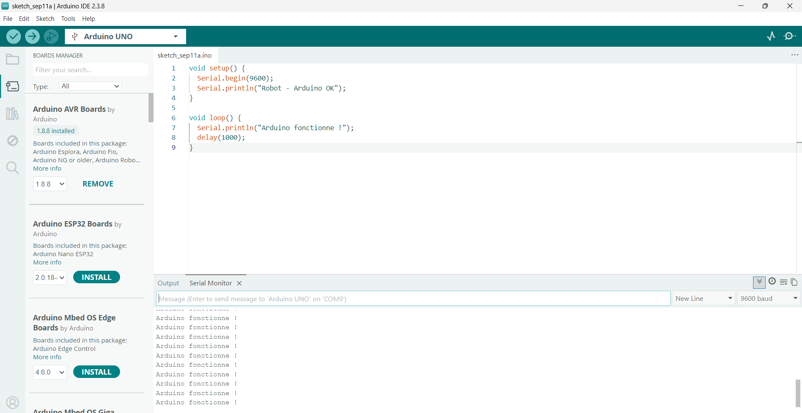
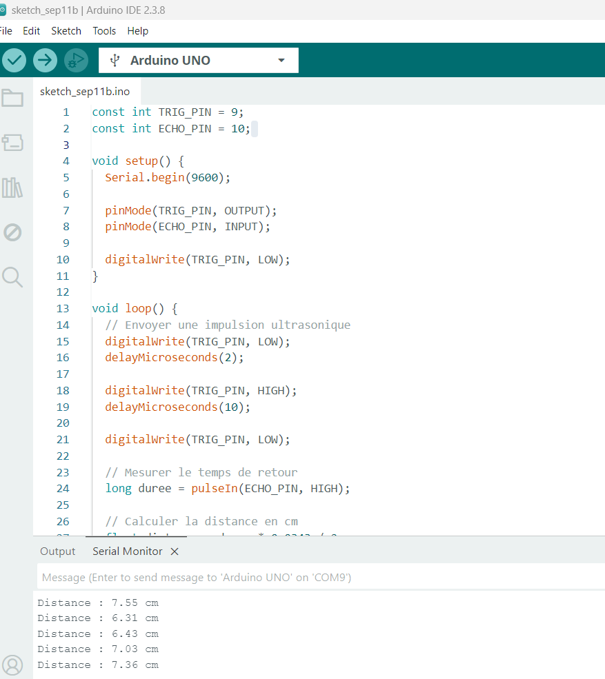

# Journal du vendredi 11 septembre 2026 (rédigé par : Komnakan YOMBOU)

## Fait aujourd'hui

- **Travaux sur le projet & Tests matériels** : 
  - Réception de l'intégralité du matériel pour le robot éducatif.
  - Poursuite des tests de composants :
    - Souci de communication rencontré entre l'écran LCD et l'ESP32 -> remplacement temporaire par l'écran OLED en attendant de se pencher à nouveau sur le LCD lors du montage final.
    - Problème d'insertion du driver moteur (mentionné L296D) sur la breadboard (problème d'espacement des broches) -> superposition temporaire avec l'Arduino UNO pour stabiliser le montage.
  - Évaluation d'une migration potentielle de l'ESP32 vers l'Arduino UNO pour simplifier les connexions et la compatibilité des composants.
  - Réalisation et validation des tests pratiques :
    - Test de la carte Arduino :
      
    - Test du capteur à ultrasons :
      

## Appris

- L'importance de valider la compatibilité physique (breadboard et brochage) des composants de puissance comme les drivers moteurs dès leur réception.
- La flexibilité nécessaire dans le choix des microcontrôleurs et des afficheurs (OLED vs LCD) face aux contraintes de câblage et de communication rencontrées en cours de route.

## Raté, puis corrigé

- Problème de communication I2C/broches avec le LCD -> contourné par l'utilisation de l'OLED.
- Incompatibilité physique du driver moteur sur la breadboard -> solution temporaire par superposition sur Arduino UNO et réflexion sur le choix final de la carte de commande.

## Décidé

- Stabiliser le choix de la carte de contrôle (arbitrage final entre ESP32 et Arduino UNO) et valider le montage électronique global avec les capteurs opérationnels.

## À faire

- Poursuivre les tests d'intégration et finaliser la structure logicielle du robot.