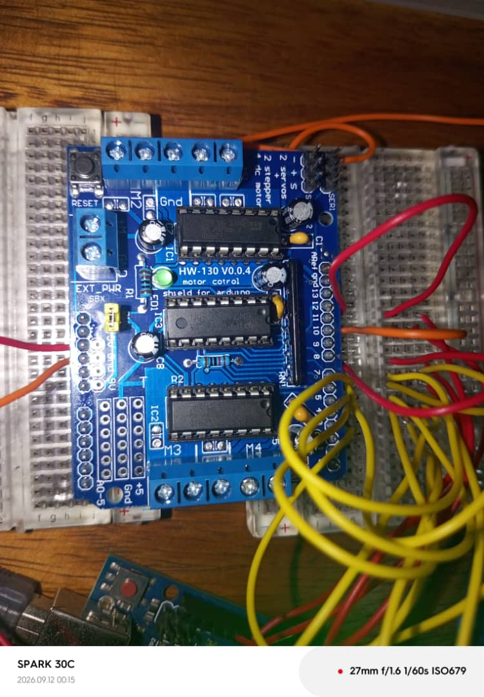

# Journal du samedi 12 septembre 2026 (rédigé par : Komnakan YOMBOU)

## Fait aujourd'hui

- **Travaux sur le projet (Robot éducatif)** : 
  - Migration de la plateforme de commande : utilisation de la carte **Arduino** et du driver moteur de puissance (type L296B / L298N) en raison des contraintes d'encombrement et de support par rapport à l'ESP32.
  - Réalisation du montage physique : superposition du driver moteur sur la carte Arduino, raccordement des moteurs DC et de l'alimentation externe.
  - **Incident critique** : lors du branchement à la machine et du lancement du programme, une surtension/court-circuit a provoqué l'extinction immédiate du PC, endommageant la carte mère et la puce Super I/O (nécessitant le remplacement de la carte mère).
  - Après sécurisation et vérification, reprise et finalisation réussie du câblage et du pilotage du driver moteur.
  - Intégration des photos du montage :
    
## Appris

- L'importance cruciale de la sécurité électrique et de l'isolation des alimentations de puissance (moteurs) par rapport à l'alimentation logique reliée par port USB à l'ordinateur, afin d'éviter tout retour de tension destructeur pour le matériel informatique.
- La gestion des contraintes d'encombrement physique des composants de puissance (drivers moteurs volumineux) sur les plaques d'essai.

## Raté, puis corrigé

- **Raté** : Court-circuit / retour de tension vers le port USB lors du test initial du driver moteur, entraînant la détérioration de la puce Super I/O et de la carte mère du PC.
- **Corrigé** : Remplacement de la carte mère de l'ordinateur, révision complète du schéma de câblage pour séparer proprement les masses et l'alimentation de puissance, puis validation réussie du fonctionnement du driver moteur.

## Décidé

- Redoubler de vigilance lors des phases de test impliquant de la puissance (moteurs) connectée en même temps à l'ordinateur.

## À faire

- Poursuivre les tests de mouvement du robot et préparer les prochaines étapes de l'intégration logicielle.