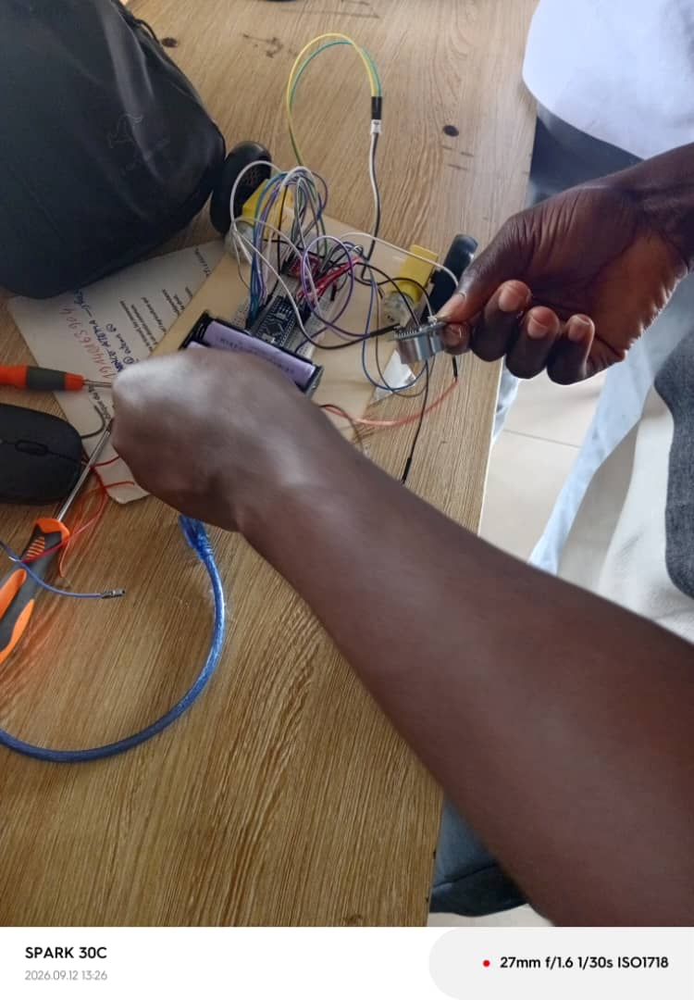

# Journal du lundi 14 septembre 2026 (rédigé par : Komnakan YOMBOU)

## Fait aujourd'hui

- **Évolution de la conception matérielle** : 
  - Abandon du volumineux driver moteur précédent au profit du driver **TB6612FNG** (plus compact et parfaitement adapté au montage).
  - Migration de la carte de commande vers l'**Arduino Nano**, offrant un encombrement réduit et une meilleure intégration physique.
- **Assemblage et Tests fonctionnels** :
  - Réalisation complète du nouveau câblage sur breadboard avec l'Arduino Nano et le driver TB6612FNG.
  - Test et validation de la carte Arduino Nano (fonctionnement nominal).
  - Test et validation des moteurs DC branchés sur le driver.
  - Test et validation du capteur à ultrasons : tout fonctionne parfaitement et sans encombre.
- **Illustrations et Démonstration** :
  - Intégration de la photo du montage réussi :
    
  - Intégration du lien vers la vidéo de démonstration du robot en action :
    [Lien Google Drive - Robot en action](https://drive.google.com/drive/folders/1oa1c9F_DsdXSloXRziNlXWKfMwQ8xHTm?usp=sharing)

## Appris

- L'importance d'utiliser des composants aux dimensions adaptées (comme le driver TB6612FNG et l'Arduino Nano) pour éviter les problèmes d'intégration physique sur plaque d'essai et sécuriser le montage électronique.
- La robustesse de la nouvelle configuration matérielle validée lors des tests combinés (moteurs + ultrasons).

## Raté, puis corrigé

- Problèmes d'encombrement et d'instabilité des composants précédents -> résolus par le remplacement de l'Arduino Uno par l'Arduino Nano et l'adoption du driver TB6612FNG, garantissant un montage propre et fonctionnel.

## Décidé

- Conserver l'Arduino Nano et le driver TB6612FNG comme architecture matérielle officielle et définitive pour le reste du projet de robot éducatif.

## À faire demain

- Poursuivre l'intégration des autres capteurs (infrarouges, microphone, buzzer) et préparer l'écriture du programme global de déplacement autonome.