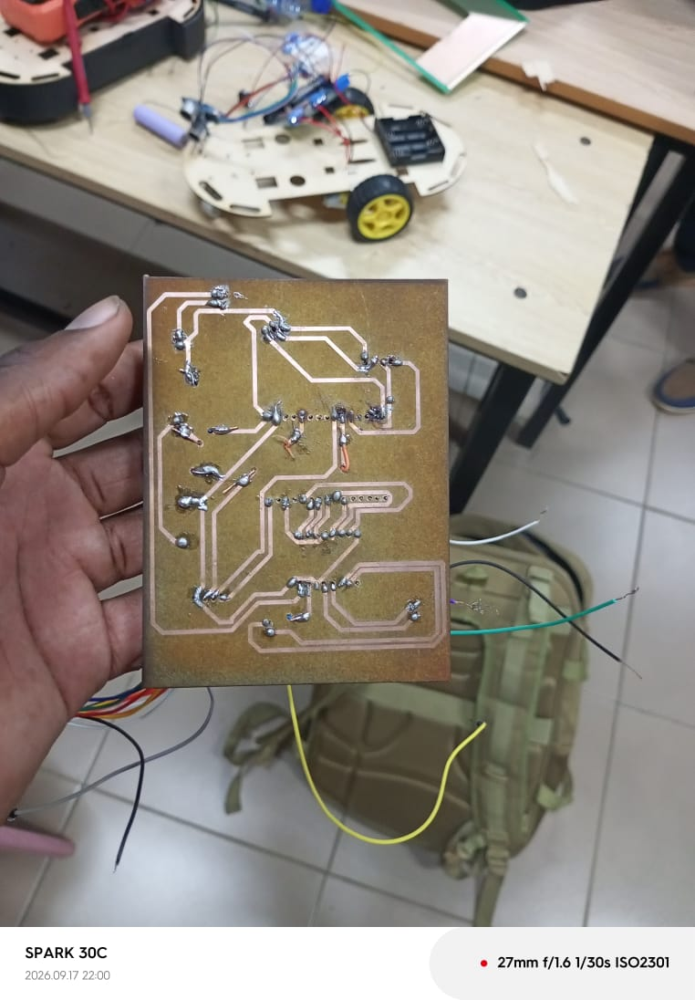
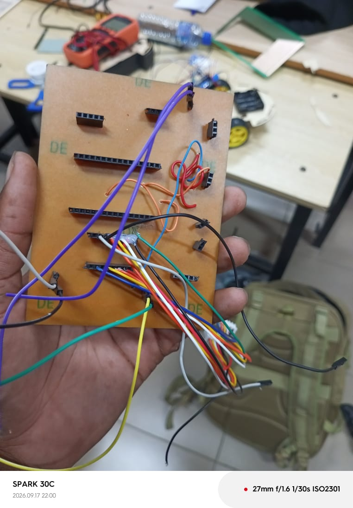
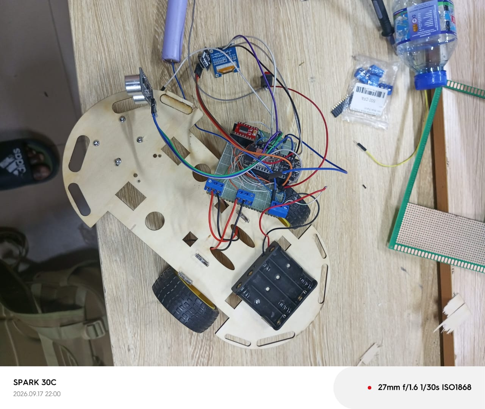
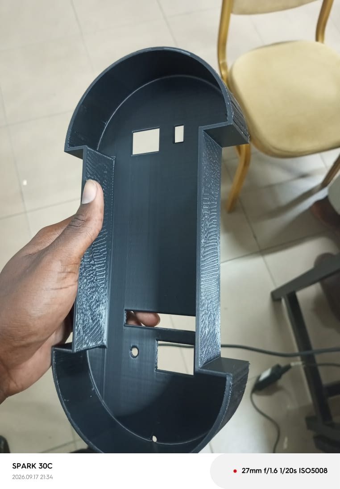
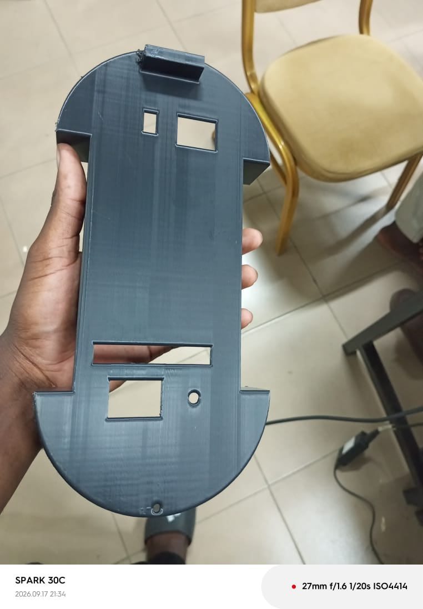
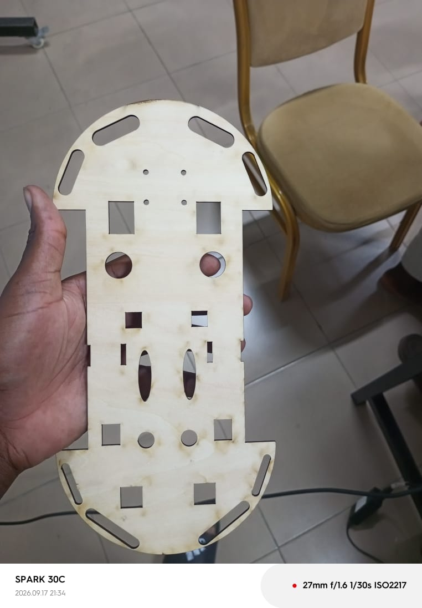

# Journal du jeudi 17 septembre 2026 (rédigé par : Komnakan YOMBOU)

## Fait aujourd'hui

- **Assemblage Électronique (PCB et Plaquettes Perforées)** :
  - Perçage, soudure des composants et réalisation des ponts de connexion sur le PCB.
  - Constat d'un dysfonctionnement à la fin des tests du PCB -> reprise du montage sur des **plaquettes perforées** qui a permis de valider le fonctionnement correct du circuit.
  - Intégration de la photo du PCB soudé :
    
    
  - Intégration de la photo du montage final validé sur plaquette perforée :
    
- **Modélisation et Impression 3D (Fusion 360 & Bambu Studio)** :
  - Modélisation initiale du boîtier et du châssis sous **Fusion 360**.
  - **Échec d'impression** : détérioration constatée lors de la première tentative d'impression du châssis et du boîtier ensemble.
    
 
  - **Préparation et Découpe / Impression** :
    - Paramétrage et préparation de l'impression dans l'interface de **Bambu Studio**.
      
    - Résultat final : boîtier imprimé avec succès.
      
      

- **Fabrication du Châssis (Découpe Laser)** :
  - Suite aux difficultés rencontrées avec l'impression 3D du châssis, recours à la **découpe laser** pour fabriquer la structure du robot dans du bois.ù
     
## Appris

- L'importance d'ajuster les paramètres d'impression 3D (supports, orientation, rétraction) pour éviter la détérioration des pièces volumineuses comme les châssis.
- La complémentarité des techniques de fabrication (impression 3D pour les boîtiers complexes et découpe laser pour la robustesse des châssis en bois).
- L'utilisation salvatrice des plaquettes perforées pour contourner rapidement un problème de routage ou de fabrication sur un PCB défectueux.

## Raté, puis corrigé

- **Raté 1** : Échec et détérioration de l'impression 3D du premier ensemble châssis/boîtier -> **Corrigé** : Remodélisation ciblée du boîtier et fabrication du châssis par découpe laser dans le bois.
- **Raté 2** : Dysfonctionnement du PCB après soudure -> **Corrigé** : Réalisation d'un montage propre et fonctionnel sur plaquette perforée.

## Décidé

- Valider le boîtier imprimé en 3D, le châssis découpé au laser et le câblage monté sur plaquette perforée comme éléments définitifs de l'enveloppe physique du robot.

## À faire

- Assembler l'ensemble des éléments (châssis bois, boîtier, électronique sur plaquette perforée et moteurs) pour la phase d'intégration finale du robot.